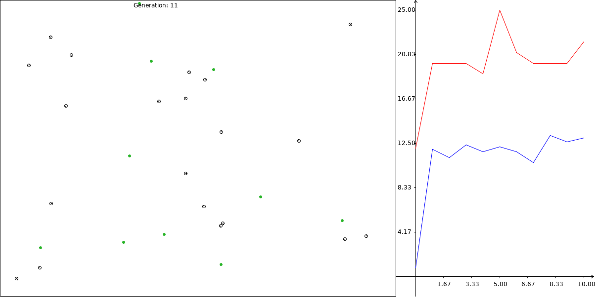

# perceptron-neural-network
A perceptron feed forward artificial neural network.
  

  
A feed forward neural network with an implementation of 'minesweepers', which are to be trained to find the nearest piece of 'food' and move towards it. These minesweepers have two input neurons, they are the angle from the nearest food and the distance.  
The neural network evolves using a genetic algorithm which takes the most successful minesweepers from one training set and merges the weights of the neural network with a mutation rate.
